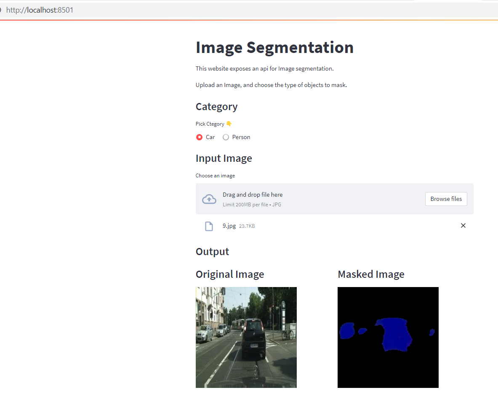

# Car Driving Segmentation

Segment cars and humans in a given picture

## Setup

- To run the project, you have to create a new conda environment.

  ```
  conda create --name image_segmentation python=3.10 -y
  conda activate image_segmentation
  ```

- To install the requirements:

  ```
  python3 -m pip install -r requirements.txt
  ```

## Contents

The project is split into 2 parts:

- EDA & Training
  There are 2 notebooks related to EDA and inference under `notebooks` directory.
  One notebook exploring the dataset and its contents. The other is used to build and train the UNet model.
- Inference
  After training the model, infernce is possible through an API and a Web Application.

  To start the api (FastAPI), from the root of the project run the following command:
  ```
  python3 -m uvicorn api.main:app --host=127.0.0.1 --port=8000
  ```
  The api will be available on http://localhost:8000

  To start the web application (Streamlit), from the root of the project run the following command:
  ```
  python3 -m streamlit run web/home.py
  ```
  The web application will be available on http://localhost:8501

  